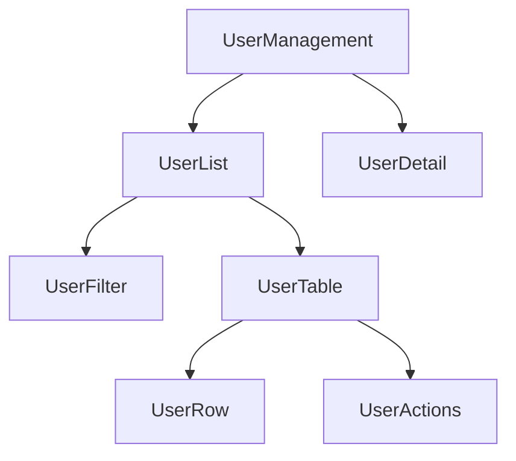

# Reading and Understanding Codebases
*Professional guide to navigating existing React projects*

## 🗺️ **Codebase Exploration Strategy**

### **Phase 1: High-Level Overview (First 2-3 hours)**

#### **1. Repository Structure Analysis**
Start by understanding the project architecture:

```bash
# Examine the top-level structure
ls -la
cat README.md
cat package.json
```

**Key Files to Check**:
- `package.json` - Dependencies, scripts, project metadata
- `README.md` - Setup instructions, project overview
- `.gitignore` - What's excluded from version control
- `tsconfig.json` / `jsconfig.json` - TypeScript/JavaScript configuration
- `.env.example` - Environment variables needed

#### **2. Dependency Analysis**
Understand the technology stack:

```javascript
// In package.json, identify:
{
  "dependencies": {
    // Core frameworks and libraries
    "react": "^18.0.0",
    "react-router-dom": "^6.0.0",
    "redux": "^4.0.0",
    // UI libraries
    "material-ui": "^5.0.0",
    "styled-components": "^5.0.0",
    // Utility libraries
    "axios": "^0.27.0",
    "lodash": "^4.17.0"
  },
  "devDependencies": {
    // Build tools, testing, linting
  }
}
```

**Create a Technology Inventory**:
```markdown
## Technology Stack
- **Frontend**: React 18, TypeScript
- **State Management**: Redux Toolkit, RTK Query
- **Routing**: React Router v6
- **Styling**: Material-UI, Emotion
- **HTTP Client**: Axios
- **Testing**: Jest, React Testing Library
- **Build Tool**: Vite/Webpack
```

#### **3. Folder Structure Mapping**
Document the organization pattern:

```
src/
├── components/          # Reusable UI components
│   ├── common/         # Shared across features
│   └── forms/          # Form-specific components
├── pages/              # Route-level components
├── hooks/              # Custom React hooks
├── services/           # API calls and external services
├── store/              # State management (Redux/Context)
├── utils/              # Helper functions
├── types/              # TypeScript type definitions
└── __tests__/          # Test files
```

---

### **Phase 2: Application Flow Understanding (Next 3-4 hours)**

#### **4. Entry Point Analysis**
Trace the application bootstrap:

```javascript
// 1. Start with index.js/tsx
import React from 'react';
import ReactDOM from 'react-dom/client';
import App from './App';

const root = ReactDOM.createRoot(document.getElementById('root'));
root.render(<App />);

// 2. Examine App.js/tsx
function App() {
  return (
    <Provider store={store}>
      <BrowserRouter>
        <ThemeProvider theme={theme}>
          <Routes>
            {/* Route definitions */}
          </Routes>
        </ThemeProvider>
      </BrowserRouter>
    </Provider>
  );
}
```

**Document the Setup Chain**:
1. What providers wrap the app? (Redux, Router, Theme, etc.)
2. How is routing configured?
3. What global state is initialized?
4. Are there any global error boundaries?

#### **5. Routing Structure**
Map out the application routes:

```javascript
// Extract route information
const routes = [
  { path: '/', component: 'HomePage' },
  { path: '/dashboard', component: 'Dashboard' },
  { path: '/users/:id', component: 'UserProfile' },
  { path: '/settings', component: 'Settings' }
];
```

**Create a Route Map**:
```markdown
## Application Routes
- `/` - Landing page
- `/dashboard` - Main dashboard (protected)
- `/users/:id` - User profile pages
- `/settings` - Application settings
- `/auth/*` - Authentication flows
```

#### **6. State Management Architecture**
Understand how data flows:

```javascript
// For Redux applications
store/
├── index.js           # Store configuration
├── rootReducer.js     # Combined reducers
├── slices/           # Feature-based slices
│   ├── authSlice.js
│   ├── userSlice.js
│   └── uiSlice.js
└── middleware/       # Custom middleware
```

**Document State Structure**:
```javascript
// Example state shape
const stateShape = {
  auth: {
    user: null,
    isAuthenticated: false,
    loading: false
  },
  users: {
    list: [],
    current: null,
    loading: false
  },
  ui: {
    theme: 'light',
    sidebarOpen: true
  }
};
```

---

### **Phase 3: Feature Deep Dive (Ongoing)**

#### **7. Component Hierarchy Analysis**
For each major feature, map the component tree:

```javascript
// Example: User Management Feature
UserManagement/
├── UserList.jsx              # Main container
│   ├── UserFilter.jsx        # Filtering controls
│   ├── UserTable.jsx         # Data display
│   │   ├── UserRow.jsx       # Individual row
│   │   └── UserActions.jsx   # Action buttons
│   └── UserPagination.jsx    # Pagination controls
└── UserDetail.jsx            # Detail view
    ├── UserProfile.jsx
    ├── UserSettings.jsx
    └── UserHistory.jsx
```

**Create Component Relationship Diagrams**:


#### **8. Data Flow Tracing**
Follow data from source to display:

```javascript
// Example: User data flow
1. API Call: services/userService.js
   ↓
2. Redux Action: store/slices/userSlice.js
   ↓
3. State Update: store state
   ↓
4. Component Subscription: useSelector hook
   ↓
5. UI Render: UserList component
```

**Document Data Patterns**:
- How is data fetched? (useEffect, RTK Query, SWR, etc.)
- Where is loading state managed?
- How are errors handled?
- Is there data caching/normalization?

---

## 🔍 **Code Analysis Techniques**

### **Reading Component Code Effectively**

#### **Component Analysis Checklist**
```javascript
// For each component, identify:
const ComponentAnalysis = {
  purpose: "What does this component do?",
  props: "What data does it receive?",
  state: "What internal state does it manage?",
  sideEffects: "What side effects does it have?",
  dependencies: "What other components/services does it use?",
  testing: "How is it tested?",
  performance: "Any performance optimizations?"
};
```

#### **Reading Hooks and State Logic**
```javascript
// Example component analysis
function UserProfile({ userId }) {
  // Props: userId (required)
  
  // Local state
  const [editing, setEditing] = useState(false);
  const [localChanges, setLocalChanges] = useState({});
  
  // Global state
  const user = useSelector(state => selectUserById(state, userId));
  const dispatch = useDispatch();
  
  // Side effects
  useEffect(() => {
    if (!user) {
      dispatch(fetchUser(userId));
    }
  }, [userId, user, dispatch]);
  
  // Event handlers
  const handleSave = useCallback(() => {
    dispatch(updateUser({ id: userId, changes: localChanges }));
    setEditing(false);
  }, [userId, localChanges, dispatch]);
  
  // Analysis notes:
  // - Fetches user data if not already loaded
  // - Manages local editing state
  // - Uses memoized callback for performance
  // - Follows container/presentation pattern
}
```

### **Understanding Business Logic**

#### **Service Layer Analysis**
```javascript
// services/userService.js
class UserService {
  async getUser(id) {
    // Business rule: Cache user data for 5 minutes
    const cached = this.cache.get(`user-${id}`);
    if (cached && Date.now() - cached.timestamp < 300000) {
      return cached.data;
    }
    
    // API call with error handling
    try {
      const response = await api.get(`/users/${id}`);
      this.cache.set(`user-${id}`, {
        data: response.data,
        timestamp: Date.now()
      });
      return response.data;
    } catch (error) {
      // Business rule: Retry failed requests
      if (error.status === 500) {
        return this.retryGetUser(id);
      }
      throw error;
    }
  }
}
```

**Document Business Rules**:
- What validation rules exist?
- What are the error handling patterns?
- Are there any business-specific calculations?
- What security/permission checks are in place?

---

## 🛠️ **Practical Exploration Tools**

### **Browser DevTools Investigation**
```javascript
// In browser console, explore the application:

// 1. Check React components
// Install React DevTools extension

// 2. Explore Redux state
window.__REDUX_DEVTOOLS_EXTENSION__?.();

// 3. Check network requests
// Use Network tab to see API calls

// 4. Profile performance
// Use Performance tab for analysis

// 5. Debug component props/state
// Use React DevTools Profiler
```

### **Code Search Strategies**
```bash
# Search for patterns in the codebase

# Find all API endpoints
grep -r "api\." src/ --include="*.js" --include="*.jsx" --include="*.ts" --include="*.tsx"

# Find all Redux actions
grep -r "dispatch\|createAction\|createSlice" src/

# Find all route definitions
grep -r "Route\|path=" src/

# Find all styled components
grep -r "styled\|css=" src/

# Find test files
find src/ -name "*.test.*" -o -name "*.spec.*"
```

### **Documentation Creation Template**
```markdown
# [Feature Name] Analysis

## Overview
Brief description of what this feature does.

## Components
- **ComponentName**: Purpose and responsibility
- **ChildComponent**: Specific role

## Data Flow
1. Data source (API/Redux/Context)
2. Processing steps
3. UI presentation

## Key Files
- `src/features/feature-name/` - Main feature directory
- `src/services/api.js` - API integration
- `src/store/slices/featureSlice.js` - State management

## Business Rules
- Rule 1: Description
- Rule 2: Description

## Dependencies
- External libraries used
- Internal dependencies

## Testing
- Test file locations
- Testing patterns used

## Notes
- Any gotchas or important considerations
- Performance implications
- Future improvement opportunities
```

---

## 📚 **Learning from Legacy Code**

### **Identifying Code Patterns**
```javascript
// Look for common patterns in the codebase

// 1. Error handling patterns
const handleApiCall = async () => {
  try {
    setLoading(true);
    const data = await apiCall();
    setData(data);
  } catch (error) {
    setError(error.message);
  } finally {
    setLoading(false);
  }
};

// 2. Form handling patterns
const useFormState = (initialState) => {
  const [values, setValues] = useState(initialState);
  const [errors, setErrors] = useState({});
  
  const handleChange = (field) => (value) => {
    setValues(prev => ({ ...prev, [field]: value }));
    if (errors[field]) {
      setErrors(prev => ({ ...prev, [field]: null }));
    }
  };
  
  return { values, errors, handleChange, setErrors };
};

// 3. Component composition patterns
const withLoading = (Component) => ({ loading, ...props }) => {
  if (loading) return <Spinner />;
  return <Component {...props} />;
};
```

### **Identifying Technical Debt**
```javascript
// Red flags to watch for:

// 1. Large, complex components (>200 lines)
// 2. Deep prop drilling
// 3. Mixed concerns (UI + business logic)
// 4. Inconsistent patterns
// 5. Missing error boundaries
// 6. No tests
// 7. Hardcoded values
// 8. Direct DOM manipulation in React
// 9. Memory leaks (uncleared timers/listeners)
// 10. Performance issues (unnecessary re-renders)
```

**Create a Technical Debt Log**:
```markdown
## Technical Debt Inventory

### High Priority
- [ ] Component X has >500 lines, needs refactoring
- [ ] Authentication logic scattered across components
- [ ] No error boundaries in main app areas

### Medium Priority
- [ ] Inconsistent state management patterns
- [ ] Missing TypeScript types in several modules
- [ ] Test coverage below 60%

### Low Priority
- [ ] Outdated dependencies
- [ ] Inconsistent code formatting
- [ ] Missing documentation
```

---

## 🎯 **Quick Start Checklist**

### **Day 1: Environment Setup**
- [ ] Clone repository and install dependencies
- [ ] Set up development environment
- [ ] Run the application locally
- [ ] Explore the running application in browser
- [ ] Check README and documentation

### **Day 2-3: High-Level Understanding**
- [ ] Map folder structure and dependencies
- [ ] Understand routing and navigation
- [ ] Identify state management approach
- [ ] Map main user flows

### **Day 4-5: Feature Deep Dive**
- [ ] Choose one feature to understand deeply
- [ ] Trace data flow from API to UI
- [ ] Understand component relationships
- [ ] Read related tests

### **Week 2: Contributing Preparation**
- [ ] Understand coding standards and conventions
- [ ] Set up development tools (linting, testing)
- [ ] Find a small task or bug to work on
- [ ] Create documentation for what you've learned

---

**Next**: Learn [Requirements Clarification](requirements.md) techniques for effective communication